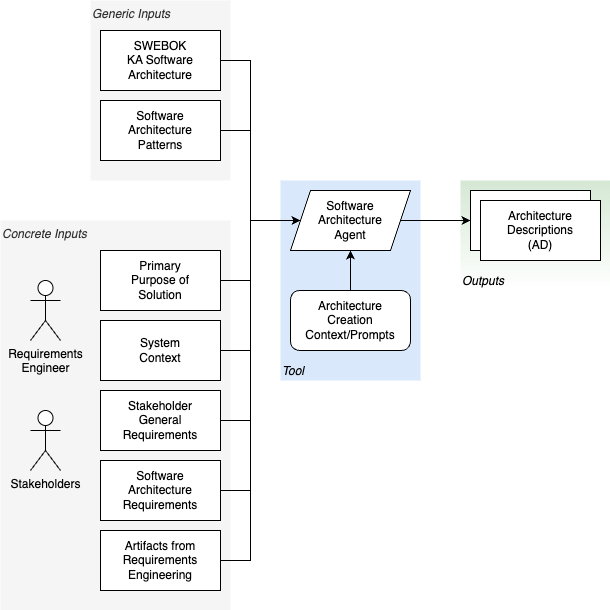

# Knowledge Area: Software Architecture

SWEBOKv4 define the architecture of a system as "its fundamental concepts or properties in its environment embodied in its elements, relationships, and in the principles of its design and evolution." (2-1 1.1.) The principal use of a software system’s architecture is to give those working with it (now including GenAI) a shared understanding of the system to guide its design (…) (2-4 1.3 Uses of architecture)

The following concepts are used:
- **Architectural Descriptions (ADs)** document an architecture for a software system (and) serve(...) as a blueprint to guide the construction of (the) system. (2-4 1.3)
- An **Architectural Pattern** expresses a common solution to a recurring problem within the context of a software system (2-4, 2.2.)

## Rationales

Coding agents need an architecture view, which is architecture descriptions from the perspective of agentic code generation. It is primarily a development view (2-4 2.1) and depicts the top-level design broken down into implementation units.

It should contain the high-level, guiding principles for
- Modules hierarchy
- Connections and interactions
- Fundamental capabilities
- How users interact with the system
- Information viewpoint: The system’s key information elements, how they are accessed and stored
- Deployment viewpoint
- Runtime considerations

It should point to publicly available and well-defined architectural patterns, if applicable.

## Driving forces

There are many driving forces for determining the software architecture of the solution
- Primary stakeholder concerns
- Company/IT governance models
- The environment the solution is working in, regarding its influences to it.
- Any of the requirements found so far in the requirements engineering process

# Integrating Generative AI

GenAI can be integrated into the process of specifying the system architecture in different ways:
- Research well-known architecture patterns for a targeted solution
- Assist in creating the C4 System Context
- Assist in deriving the C4 Container Context (if desired)
- Complete in-progress Architecture Decision Records
- Check for coherence of the complete set of Architecture Decision Records and the overall system architecture

# Inputs and Input Types

- Primary purpose of the targeted solution
- References to applicable well-known architecture patterns
- Already formulated requirements, e.g. 
  - Any models or (C4) diagrams of System Context, optionally Container Context
- All guiding principles references

# Outputs 

The primary outputs of this process should be:

- Architecture Descriptions, including Archiecture Viewpoints, styles and patterns, and
- Non-Functional Requirements for crosscutting concerns such as performance, reliability, security etc.

# Practises

## Usage of Reasoning models 

> Use LLMs with reasoning capabilities to detail out or even find System Architecture Patterns and Descriptions

## Identify new (nonfunctional) requirements and constraints

> When detailing out the system architecture, capture new requirements that might come up. Feed back into System Architecture process 